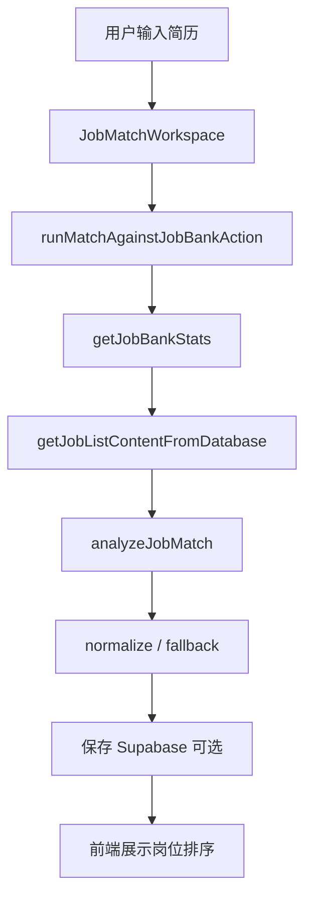
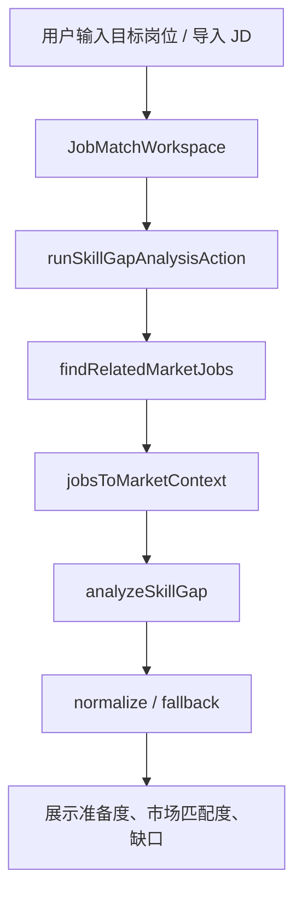
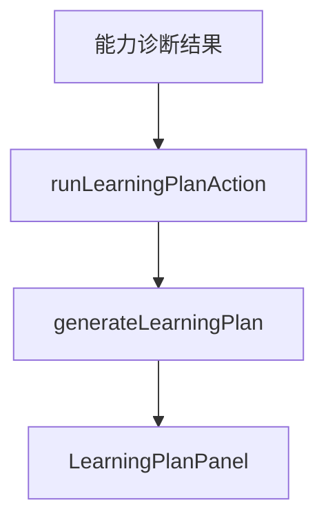

# Yifei Labs 前端架构设计

本文基于当前前端重构后的代码状态整理，覆盖产品界面分层、路由结构、组件架构、交互状态、样式体系、已观察到的问题，以及后续演进方向。

## 1. 前端定位

Yifei Labs 当前前端不再只是一个简历上传页，而是一个面向求职决策的 AI Career Intelligence 工作台。

核心体验分为三层：

1. 首页叙事层：用 3D 职业路径地图建立产品心智，表达“从简历到投递路径”的完整流程。
2. 工作台操作层：承载简历输入、岗位匹配、能力诊断、学习计划、简历优化等核心任务。
3. 岗位样本层：提供本地岗位库浏览、筛选、进入目标岗位诊断的入口。

当前重构方向整体成立：视觉上从传统表单工具升级为“路径化、任务化、结果导向”的职业分析产品。需要继续注意的是，首页的沉浸感不能压过工作台的效率，工作台应保持更清晰、更密集、更可操作。

## 2. 技术栈

| 层级 | 当前方案 |
| --- | --- |
| Web 框架 | Next.js 16 App Router |
| UI 框架 | React 19 |
| 样式 | Tailwind CSS 4 + 全局 CSS 动效体系 |
| 3D 可视化 | Three.js |
| 服务交互 | Server Actions |
| AI 能力 | OpenAI-compatible SDK，支持 MiniMax / OpenAI |
| 文件解析 | PDF / DOCX / TXT / MD / CSV |
| 数据 | 本地 `data/job-database.json` + 可选 Supabase |

## 3. 路由架构

当前路由由 `src/app` 承载：

```text
src/app/
  layout.tsx
  page.tsx
  dashboard/page.tsx
  apps/job-match/
    page.tsx
    actions.ts
    job-bank/page.tsx
    history/page.tsx
    history/[id]/page.tsx
```

### 页面职责

| 路由 | 职责 |
| --- | --- |
| `/` | 首页，展示 3D 职业路径、能力入口、工作流程和 CTA |
| `/apps/job-match?mode=job-bank` | 岗位匹配工作台 |
| `/apps/job-match?mode=market-fit` | 能力诊断工作台 |
| `/apps/job-match/job-bank` | 岗位样本库浏览和筛选 |
| `/apps/job-match/history` | 历史分析记录 |
| `/apps/job-match/history/[id]` | 单条历史分析详情 |
| `/dashboard` | 仪表盘扩展页，目前偏预留性质 |

### 路由状态

工作台通过 URL query 控制模式：

```text
mode=job-bank
mode=market-fit
role=目标岗位
jd=可选岗位描述
```

这是一个适合 MVP 的设计，因为它天然支持：

- 从岗位库跳转到能力诊断
- 从 Chrome 扩展导入 JD 后直接进入目标岗位分析
- 分享或恢复某个工作台入口状态

后续如果模式状态变复杂，可以保留 URL 作为外部状态入口，同时把内部工作流状态沉淀到 client store 或服务端 session。

## 4. 组件架构

当前组件可以分为五类。

### 4.1 布局组件

```text
src/components/layout/
  Navbar.tsx
  Footer.tsx
```

职责：

- 提供全站导航、当前路由高亮、移动端菜单
- 在所有页面保留产品品牌和合规提示

建议后续把导航配置抽成独立 `navigation.ts`，避免文案、href、active 逻辑散落在组件里。

### 4.2 首页组件

```text
src/components/home/
  CareerMap3D.tsx
```

职责：

- Three.js 绘制 3D 职业路径
- 提供 WebGL 不可用或减少动画偏好下的静态 fallback
- 构建首页第一屏的产品记忆点

当前实现有比较完整的资源释放逻辑，这是好的。后续要控制首页性能预算，尤其是移动端粒子数、canvas 渲染和首屏 LCP。

### 4.3 业务工作台组件

```text
src/components/job-match/
  JobMatchWorkspace.tsx
  JobBankBrowser.tsx
  LearningPlanPanel.tsx
  ReportToolbar.tsx
```

职责：

- `JobMatchWorkspace`：核心客户端工作台，管理输入、模式、异步分析、结果展示和报告导出。
- `JobBankBrowser`：岗位库筛选、统计、列表和跳转诊断。
- `LearningPlanPanel`：诊断后的 30 天学习计划展示。
- `ReportToolbar`：Markdown / 打印 PDF 导出入口。

当前最大的问题是 `JobMatchWorkspace` 职责过重，已经同时承担：

- URL query 同步
- 表单状态
- 文件上传
- 异步任务进度
- 岗位匹配结果
- 能力诊断结果
- 学习计划
- 简历优化
- 报告数据组装
- 多种结果卡片渲染

建议下一阶段拆分为：

```text
JobMatchWorkspace
  WorkspaceHeader
  ModeSwitcher
  CandidateInputPanel
  ResumeInputPanel
  CorpusStatusCard
  AnalysisStatusCard
  JobBankMatchView
  MarketFitView
  RoleDetailPanel
  ResultEmptyState
```

同时把异步业务逻辑提取到 hooks：

```text
useJobBankStats
useResumeInput
useJobMatchAnalysis
useMarketFitAnalysis
useLearningPlan
useResumeOptimization
```

这样能降低单文件复杂度，也方便后续做测试和局部迭代。

### 4.4 UI 基础组件

```text
src/components/ui/
  AnimatedNumber.tsx
  Badge.tsx
  Button.tsx
  Card.tsx
  CopyButton.tsx
  Input.tsx
  LoadingSpinner.tsx
  Progress.tsx
  Select.tsx
  Textarea.tsx
```

这些组件已经形成轻量 design system。后续建议补齐：

- `Tabs`
- `SegmentedControl`
- `EmptyState`
- `Toast`
- `Modal`
- `Tooltip`
- `FileUpload`
- `MetricCard`
- `ScoreMeter`

这样可以把当前页面里的重复结构沉淀成稳定组件，而不是继续在业务组件里堆 Tailwind class。

### 4.5 Server Actions 边界

```text
src/app/apps/job-match/actions.ts
```

前端通过 Server Actions 访问文件解析、岗位库、AI 分析、Supabase 保存等能力。这个边界是合理的，因为客户端不直接接触：

- 文件系统
- AI SDK
- service role key
- Supabase 写入逻辑
- 本地岗位库写入逻辑

当前统一返回：

```ts
type ActionState<T> =
  | {
      ok: true;
      data: T;
      projectId?: string | null;
      source?: "ai" | "fallback";
      warning?: string;
    }
  | { ok: false; error: string };
```

建议保留这个模式，并进一步标准化错误码：

```ts
type ActionErrorCode =
  | "VALIDATION_ERROR"
  | "AI_UNAVAILABLE"
  | "PARSE_FAILED"
  | "JOB_BANK_EMPTY"
  | "PERSIST_FAILED";
```

这样前端可以针对不同错误显示不同恢复动作，而不是只展示一段错误文本。

## 5. 状态架构

当前工作台状态主要集中在 `JobMatchWorkspace` 内部：

| 状态类型 | 示例 |
| --- | --- |
| 表单输入 | 候选人信息、简历、地点、语言 |
| 路由模式 | `job-bank` / `market-fit` |
| URL 导入 | `role` / `jd` |
| 异步状态 | 分析中、文件解析中、学习计划生成中 |
| 结果状态 | 岗位匹配、能力诊断、学习计划、简历优化 |
| UI 状态 | 选中岗位、详情 tab、复制状态、错误提示 |

MVP 阶段这样写速度快，但后续会遇到三个问题：

1. 新功能加进来会让工作台继续膨胀。
2. 多个异步流程之间的清理规则容易互相影响。
3. 很难为某个局部流程写稳定测试。

建议演进为“页面容器 + hooks + 展示组件”的结构：

```text
页面容器
  负责读取 URL、组合 hooks、传递 props

业务 hooks
  负责状态机、Server Action 调用、错误归一化

展示组件
  只负责 UI 展示和用户事件回调
```

## 6. 样式与视觉体系

当前视觉语言包括：

- 暗色 3D 首屏
- glass panel
- segment control
- 轻量卡片
- score bar
- animated number
- fade-up / slide-in / shimmer 动效
- 移动端底部固定 CTA

整体观感比之前更有产品感，但需要注意几个方向：

1. 首页可以保持沉浸式，但工作台应该减少装饰，优先提高信息扫描效率。
2. 目前全局 CSS 中动效和页面样式较集中，后续应拆成 design tokens、motion、components 三类。
3. 卡片圆角当前偏大，工作台密集界面建议统一到 8px 或 10px，避免太像营销页。
4. 需要建立颜色语义，而不是直接到处写 `indigo/zinc/cyan`。

建议定义基础 token：

```css
--color-bg
--color-surface
--color-surface-muted
--color-border
--color-text
--color-text-muted
--color-primary
--color-success
--color-warning
--color-danger
```

## 7. 数据流

### 岗位匹配



### 能力诊断



### 学习计划



## 8. 当前观察到的问题

### 8.1 Dev 环境路由异常

本地验证结果：

- `npm run lint` 通过
- `npm run build` 通过
- `next start -p 3001` 正常访问页面
- `npm run dev` 当前在 `http://localhost:3000` 返回 App Router 的 404，但 layout 能正常渲染

这说明生产构建是可用的，但 dev server 的路由产物或缓存状态异常。建议优先尝试：

```bash
Remove-Item -Recurse -Force .next
npm run dev
```

如果仍然复现，再检查 Next 16 dev / Turbopack 的兼容性，必要时临时固定 Next 小版本或禁用相关实验能力。

### 8.2 首页和设计稿的品牌差异

设计稿是“简历智评 AI / AI 简历评测 / 智能岗位匹配”的暗色产品首页。当前实现是“Yifei Labs / Career Intelligence / 职业路径地图”。

这不是错误，但需要产品层面明确：

- 如果目标是独立工具，建议品牌更直接：`简历智评 AI`
- 如果目标是平台矩阵，当前 `Yifei Labs` 更合适
- 首页 H1 可以继续强化“简历评测 + 岗位匹配”的直接收益，避免用户只感知到抽象职业路径

### 8.3 工作台组件过大

`JobMatchWorkspace` 已经超过适合长期维护的复杂度。它现在是产品主流程的中枢，建议下一阶段优先拆分。

### 8.4 动画数字需要注意测试读取

岗位库统计使用 `AnimatedNumber`，视觉上没问题，但自动化测试中如果立即读取文本，会拿到动画中间值。后续 E2E 测试应等待动画结束，或给数据层增加稳定的 `data-value`。

### 8.5 首页 3D 性能需要持续监控

Three.js 首页已经有移动端降级和资源释放，但它仍然是首屏性能风险点。建议增加：

- Web Vitals 监控
- 移动端低性能设备降级策略
- Canvas 是否成功渲染的可观测日志
- 首页首屏截图回归

## 9. 后续发展方向

### 阶段一：稳定 MVP 体验

目标：保证当前功能稳定、可演示、可复用。

建议任务：

- 修复或定位 `npm run dev` 404 问题
- 拆分 `JobMatchWorkspace`
- 给关键 Server Actions 增加错误码
- 给岗位库和工作台增加基础 E2E 测试
- 增加首页、工作台、岗位库的移动端截图检查
- 补齐 Supabase 表结构文档
- 把 README / 架构文档统一为 UTF-8 并检查中文显示

### 阶段二：提升工作台专业度

目标：从“能分析”升级到“像专业求职顾问工具”。

建议任务：

- 增加分析结果的证据引用：指出简历中哪些内容支撑某个判断
- 结果页支持岗位对比：2-3 个目标岗位横向比较
- 简历优化支持“原文片段 -> 建议 -> 改写结果”
- 学习计划支持任务完成状态
- 报告导出支持更正式的 PDF 模板
- 增加用户可编辑的目标岗位画像

### 阶段三：数据与账号体系

目标：从本地 MVP 走向可持续产品。

建议任务：

- 将岗位库从本地 JSON 迁移到数据库
- 建立用户、项目、分析记录、简历版本、岗位收藏模型
- 支持多份简历和多轮分析历史
- 支持岗位样本定期更新
- 增加权限和隐私控制
- 给 Chrome 扩展导入 JD 改为更稳定的短链或临时 token，而不是长 URL query

### 阶段四：智能化增强

目标：让产品从分析报告变成持续职业助手。

建议任务：

- 引入多轮对话式追问，补齐简历缺失信息
- 支持根据目标岗位生成项目作品集选题
- 支持面试题和模拟面试
- 支持投递策略：岗位优先级、城市、薪资、行业偏好
- 支持岗位 JD 与简历的逐条匹配解释
- 支持简历版本 A/B 对比

### 阶段五：产品矩阵化

目标：从单一 Job Match App 扩展为 Yifei Labs 工具矩阵。

可以发展为：

- Resume Intelligence：简历评测、改写、版本管理
- Job Match：岗位匹配、岗位库、JD 诊断
- Skill Roadmap：学习计划、项目任务、进度追踪
- Interview Coach：面试准备、模拟问答、反馈报告
- Career Dashboard：求职进度、投递记录、能力成长曲线

对应前端架构可以演进为：

```text
src/
  app/
    apps/
      resume-review/
      job-match/
      skill-roadmap/
      interview-coach/
  features/
    resume/
    job-bank/
    analysis/
    report/
  components/
    ui/
    layout/
  lib/
    actions/
    ai/
    data/
  types/
```

## 10. 总结

当前前端重构已经从“单功能 MVP 页面”迈向“职业分析工作台”。首页有记忆点，岗位库可浏览，工作台闭环清晰，Server Actions 边界也合理。

下一阶段最重要的不是继续堆视觉，而是把核心工作台拆稳、把数据和异步状态标准化、把 dev 运行异常和测试体系补上。这样产品会从“好看可演示”变成“可靠可持续迭代”。
