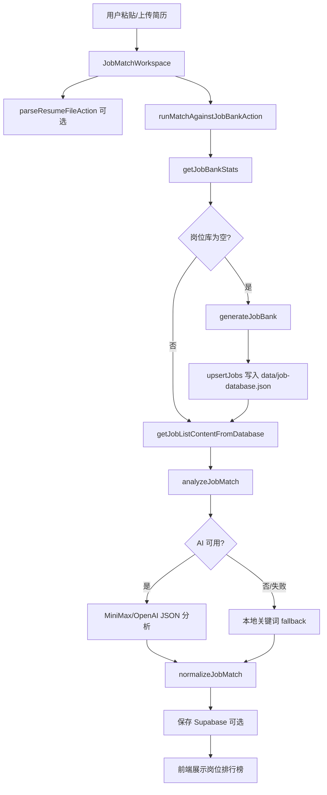
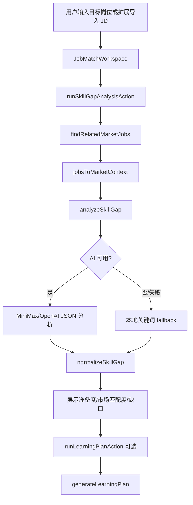
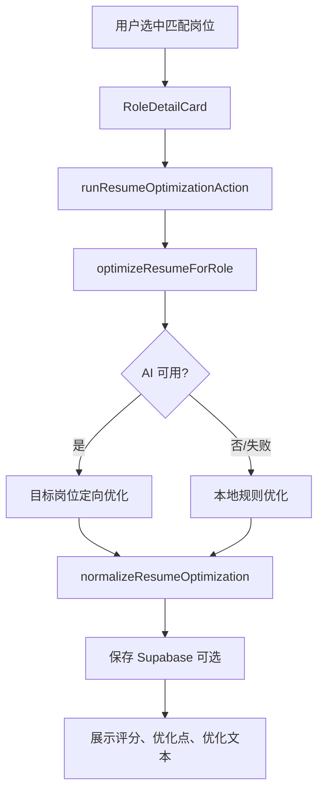

# Yifei Labs 项目架构

本文档基于当前代码状态整理，描述 `Yifei Labs - Career Intelligence` 的整体架构、关键模块、数据流、外部依赖与后续扩展点。

## 1. 项目定位

Yifei Labs 是一个面向求职者的 AI 职业分析 Web MVP，核心目标是把「投什么岗位」和「补什么能力」结构化表达出来。

当前产品包含两条主路径：

1. **岗位匹配**
   用户粘贴或上传简历，系统从本地岗位库中读取市场风格岗位样本，通过大模型或本地规则输出岗位匹配排行榜、匹配原因、优势、缺口和简历建议。

2. **能力诊断**
   用户输入目标岗位，也可以通过浏览器扩展从 Boss/智联导入 JD。系统结合简历、目标岗位和本地岗位库中的相关市场样本，输出岗位准备度、市场匹配度、缺失能力、学习优先级、简历改进和面试建议。

辅助能力包括：

- PDF / DOCX / TXT / MD / CSV 简历解析
- 30 天学习计划与项目选题生成
- 面向目标岗位的简历优化
- Markdown / 打印 PDF 报告导出
- 本地 JSON 岗位库
- Supabase 历史记录，可选
- Boss / 智联 JD 导入 Chrome 扩展

## 2. 技术栈

| 层级 | 技术 |
| --- | --- |
| Web 框架 | Next.js 16 App Router |
| UI | React 19, Tailwind CSS 4 |
| 语言 | TypeScript |
| AI SDK | `openai` SDK，兼容 OpenAI-compatible API |
| 默认模型 | MiniMax-M3 |
| 简历解析 | `unpdf`, `mammoth` |
| 可选数据库 | Supabase / PostgreSQL |
| 本地数据 | `data/job-database.json` |
| 浏览器扩展 | Chrome Manifest V3 |

## 3. 顶层目录结构

```text
yifei-labs/
  data/
    job-database.json
  extensions/
    jd-importer/
  scripts/
    seed-job-bank.mjs
    seed-job-bank-grok.mjs
    seed-job-bank-grok-hot.mjs
    smoke-core.mjs
  src/
    app/
    components/
    lib/
    types/
  package.json
  next.config.ts
  README.md
  项目架构.md
```

### 目录职责

| 目录 | 职责 |
| --- | --- |
| `src/app` | Next.js App Router 页面、布局和 Server Actions |
| `src/components` | UI 组件、布局组件、业务组件 |
| `src/lib` | AI 调用、岗位库、文件解析、报告导出、Supabase、工具函数 |
| `src/types` | 业务类型定义 |
| `data` | 本地岗位库 JSON 文件 |
| `scripts` | 岗位库种子脚本与核心烟测脚本 |
| `extensions/jd-importer` | Boss / 智联 JD 导入浏览器扩展 |

## 4. 路由架构

```text
src/app/
  layout.tsx
  page.tsx
  dashboard/page.tsx
  apps/job-match/
    page.tsx
    actions.ts
    job-bank/page.tsx
    history/page.tsx
    history/[id]/page.tsx
```

### 页面说明

| 路由 | 文件 | 类型 | 功能 |
| --- | --- | --- | --- |
| `/` | `src/app/page.tsx` | Server Component | 首页，介绍能力、入口和产品价值 |
| `/dashboard` | `src/app/dashboard/page.tsx` | Server Component | 仪表盘占位/扩展页 |
| `/apps/job-match` | `src/app/apps/job-match/page.tsx` | Server Component 包 Client Workspace | 职业分析工作台 |
| `/apps/job-match?mode=job-bank` | 同上 | Client UI 状态 | 岗位匹配模式 |
| `/apps/job-match?mode=market-fit` | 同上 | Client UI 状态 | 能力诊断模式 |
| `/apps/job-match/job-bank` | `job-bank/page.tsx` | Server + Client | 岗位库浏览器 |
| `/apps/job-match/history` | `history/page.tsx` | Server Component | Supabase 历史记录列表 |
| `/apps/job-match/history/[id]` | `history/[id]/page.tsx` | Server Component | 单条历史分析详情 |

`/apps/job-match` 的模式由 URL query `mode` 控制：

- `mode=job-bank`：简历匹配岗位库
- `mode=market-fit`：目标岗位能力诊断

Chrome 扩展会打开：

```text
/apps/job-match?mode=market-fit&role=...&jd=...
```

工作台会读取 `role` 和 `jd` 参数，自动填充目标岗位和 JD。

## 5. 核心业务组件

### `JobMatchWorkspace`

文件：`src/components/job-match/JobMatchWorkspace.tsx`

这是当前应用最核心的客户端组件，负责完整工作台交互。

主要职责：

- 读取 URL query，判断当前模式
- 管理候选人基础信息、简历内容、目标岗位、JD
- 上传并解析简历文件
- 调用 Server Actions 完成岗位匹配、能力诊断、学习计划、简历优化
- 展示扫描进度、错误、警告、AI/fallback 来源
- 展示岗位匹配列表、目标岗位诊断、学习计划、简历优化结果
- 组装报告数据，交给 `ReportToolbar` 导出

关键状态：

| 状态 | 含义 |
| --- | --- |
| `input` | 候选人信息、简历、语言偏好、地点等 |
| `mode` | 当前工作台模式，由 URL query 控制 |
| `targetRole` | 能力诊断目标岗位 |
| `optionalJd` | 可选 JD |
| `result` | 岗位匹配结果 |
| `gapResult` | 能力诊断结果 |
| `learningPlan` | 30 天学习计划 |
| `optimizationResult` | 简历优化结果 |
| `jobBankStats` | 本地岗位库统计 |
| `analysisSource` | 当前结果来自 `ai` 还是 `fallback` |

### `JobBankBrowser`

文件：`src/components/job-match/JobBankBrowser.tsx`

用于展示 `data/job-database.json` 中的岗位样本。

功能：

- 岗位总量、来源数量、地点覆盖统计
- 按关键词、来源、地点筛选
- 分页式加载更多
- 单个岗位卡片展示要求、描述、关键词
- 一键进入能力诊断，并把岗位标题带到 URL 参数中

### `LearningPlanPanel`

文件：`src/components/job-match/LearningPlanPanel.tsx`

展示能力诊断后的后续动作：

- 生成 30 天学习路径
- 展示 4 周学习计划
- 展示推荐项目
- 展示里程碑和资源建议
- 支持重新生成计划

### `ReportToolbar`

文件：`src/components/job-match/ReportToolbar.tsx`

负责报告导出：

- 导出 Markdown 文件
- 打开打印窗口，使用浏览器打印为 PDF

底层依赖 `src/lib/reportExport.ts`。

### UI 基础组件

```text
src/components/ui/
  AnimatedNumber.tsx
  Badge.tsx
  Button.tsx
  Card.tsx
  CopyButton.tsx
  Input.tsx
  LoadingSpinner.tsx
  Progress.tsx
  Select.tsx
  Textarea.tsx
```

这些组件提供统一的表单、按钮、卡片、进度、数字动画和复制体验。

## 6. Server Actions 架构

文件：`src/app/apps/job-match/actions.ts`

Server Actions 是前端 Client Component 与服务端能力之间的边界。

当前导出的 Action：

| Action | 输入 | 输出 | 说明 |
| --- | --- | --- | --- |
| `runRoleDirectionAction` | `RoleDirectionInput` | `RoleDirectionResult` | 根据简历推荐岗位方向 |
| `runJobMatchAction` | `JobMatchInput` | `JobMatchResult` | 对用户提供的岗位列表做匹配 |
| `runMatchAgainstJobBankAction` | 简历信息 + 可选方向 | `JobMatchResult + jobListContent + stats` | 一键读取/生成岗位库并匹配 |
| `runSkillGapAnalysisAction` | `SkillGapAnalysisInput` | `SkillGapAnalysisResult + marketJobsUsed` | 结合市场样本做目标岗位诊断 |
| `runLearningPlanAction` | `LearningPlanInput` | `LearningPlanResult` | 根据差距分析生成 30 天计划 |
| `runResumeOptimizationAction` | `ResumeOptimizationInput` | `ResumeOptimizationResult` | 生成目标岗位定向简历 |
| `parseResumeFileAction` | `FormData` | `{ text, format }` | 服务端解析 PDF/DOCX 等文件 |
| `getJobBankStatsAction` | 无 | `JobBankStats` | 读取本地岗位库统计 |
| `runGenerateJobBankAction` | `GenerateJobBankInput` | jobs + stats + jobListContent | 生成并写入岗位库 |
| `loadJobBankForMatchAction` | 过滤选项 | jobListContent + stats | 从本地岗位库加载岗位文本 |

统一返回类型：

```ts
type ActionState<T> =
  | {
      ok: true;
      data: T;
      projectId?: string | null;
      source?: "ai" | "fallback";
      warning?: string;
    }
  | { ok: false; error: string };
```

这个设计让前端可以统一处理：

- 成功数据
- 错误提示
- AI/fallback 来源
- 非阻塞警告
- 可选持久化 ID

## 7. AI 服务层

文件：`src/lib/openai.ts`

这是所有大模型能力的统一入口。

### 主要能力

| 函数 | 功能 |
| --- | --- |
| `recommendRoleDirections` | 根据简历推荐岗位方向 |
| `generateJobBank` | 根据简历和方向生成合成岗位库 |
| `analyzeJobMatch` | 简历与岗位列表匹配 |
| `analyzeSkillGap` | 目标岗位市场匹配与技能差距分析 |
| `generateLearningPlan` | 生成 30 天学习计划 |
| `optimizeResumeForRole` | 定向优化简历 |

### OpenAI-compatible 客户端

服务层使用 `openai` SDK，通过环境变量兼容 MiniMax 或 OpenAI。

优先级：

```text
apiKey:
  MINIMAX_API_KEY
  OPENAI_API_KEY

baseURL:
  MINIMAX_BASE_URL
  OPENAI_BASE_URL
  https://api.minimaxi.com/v1

model:
  AI_MODEL
  MiniMax-M3
  gpt-4.1-mini
```

当前 `.env.example` 推荐国内 MiniMax 入口：

```text
MINIMAX_BASE_URL=https://api.minimaxi.com/v1
AI_MODEL=MiniMax-M3
```

### 结构化 JSON 输出

`createStructuredCompletion` 做了统一封装：

- system message 要求模型只返回 JSON
- `response_format: { type: "json_object" }`
- MiniMax-M3 时启用 `thinking: { type: "disabled" }`
- 设置 `max_completion_tokens`
- 解析前清理 markdown code fence 和 `<think>...</think>`

### 结果标准化

AI 返回后并不直接给前端，而是经过 normalize：

- `normalizeRoleDirections`
- `normalizeJobMatch`
- `normalizeSkillGap`
- `normalizeLearningPlan`
- `normalizeResumeOptimization`
- `normalizeGeneratedJobs`

这些函数负责：

- 数字分数 clamp 到 0-100
- 数组字段清洗
- 缺省字段补齐
- 排序
- 丢弃无效项
- 对空结果抛错并触发 fallback

### Fallback 策略

所有核心 AI 能力都有 fallback：

- 未配置 API Key 时 fallback
- API 调用失败时 fallback
- JSON 解析失败或结构无效时 fallback

Fallback 基于关键词提取和规则生成，保证产品在无 key 或模型不稳定时仍可演示。

## 8. Prompt 架构

目录：`src/lib/prompts`

| 文件 | 作用 |
| --- | --- |
| `roleDirectionPrompt.ts` | 从简历推荐岗位方向和搜索词 |
| `jobBankPrompt.ts` | 生成合成市场岗位样本 |
| `jobMatchPrompt.ts` | 简历与岗位列表匹配排序 |
| `skillGapPrompt.ts` | 目标岗位市场匹配与技能差距分析 |
| `learningPlanPrompt.ts` | 生成 30 天学习计划与项目 |
| `resumeOptimizePrompt.ts` | 生成目标岗位定向简历 |

Prompt 的共同原则：

- 严格返回 JSON
- 不允许编造经历、学历、公司、项目、指标或证书
- 中文偏好时输出中文
- 以简历证据为边界
- 对岗位库内容标明是合成市场样本，不宣称实时在招

## 9. 本地岗位库

文件：`data/job-database.json`

当前岗位库统计：

```text
version: 1
jobs: 54
sources: grok, minimax
```

### 数据结构

核心类型：`StoredJob`

```ts
interface StoredJob {
  id: string;
  title: string;
  company: string;
  location: string;
  salary: string;
  platformStyle: "boss" | "zhilian" | "market";
  requirements: string;
  description: string;
  keywords: string[];
  relatedDirections: string[];
  source: "minimax" | "grok" | "fallback";
  batchId: string;
  createdAt: string;
}
```

### 岗位库服务

文件：`src/lib/jobDatabase.ts`

主要函数：

| 函数 | 说明 |
| --- | --- |
| `loadJobDatabase` | 读取 JSON 文件 |
| `saveJobDatabase` | 写入 JSON 文件 |
| `getJobBankStats` | 统计岗位总量、批次、标题 |
| `listStoredJobs` | 返回全部岗位 |
| `normalizeStoredJob` | 规范化岗位对象 |
| `upsertJobs` | 按 `title + company` 去重写入 |
| `jobsToListContent` | 转成岗位匹配 prompt 使用的纯文本 |
| `getJobListContentFromDatabase` | 按方向过滤并限制数量 |
| `findRelatedMarketJobs` | 根据目标岗位找相关市场样本 |
| `jobsToMarketContext` | 转成能力诊断 prompt 的市场上下文 |

### 合规边界

岗位库是 AI 生成的市场风格样本，不是 Boss/智联实时爬取数据。页面和报告中都需要继续保留这个说明，避免误导用户。

## 10. 简历解析

文件：`src/lib/parseResume.ts`

支持格式：

- `.txt`
- `.md`
- `.csv`
- `.pdf`
- `.docx`

限制：

- 文件大小最大 8MB
- `.doc` 不支持，提示用户另存为 `.docx` 或 PDF
- PDF 如果可提取文字过少，会提示可能是扫描件

依赖：

- `unpdf`：PDF 文本提取
- `mammoth`：DOCX 原始文本提取

`next.config.ts` 中配置：

```ts
serverExternalPackages: ["unpdf", "mammoth"]
```

## 11. 报告导出

文件：`src/lib/reportExport.ts`

报告结构类型：`ReportBundle`

可包含：

- 候选人信息
- 岗位匹配结果
- 能力诊断结果
- 学习计划结果
- 报告模式
- 生成时间

导出能力：

| 函数 | 说明 |
| --- | --- |
| `buildReportMarkdown` | 把结构化结果转成 Markdown |
| `downloadTextFile` | 浏览器下载文本文件 |
| `markdownToSimpleHtml` | 轻量 Markdown 转 HTML |
| `printReportAsPdf` | 打开打印窗口，调用浏览器打印 |

当前 PDF 不是后端生成的二进制 PDF，而是浏览器打印能力。

## 12. Supabase 持久化

文件：`src/lib/supabase.ts`

Supabase 是可选依赖。未配置环境变量时，应用仍可正常运行，只是不保存/读取历史记录。

需要环境变量：

```text
NEXT_PUBLIC_SUPABASE_URL
SUPABASE_SERVICE_ROLE_KEY
```

当前支持的表：

### `job_match_projects`

保存岗位匹配历史。

字段：

- `id`
- `created_at`
- `full_name`
- `current_status`
- `experience_level`
- `preferred_language`
- `preferred_location`
- `resume_content`
- `job_match_result`

### `resume_optimizations`

保存简历优化记录。

字段：

- `id`
- `created_at`
- `job_match_project_id`
- `selected_role`
- `optional_job_description`
- `optimization_result`

注意：`README.md` 目前只写了 `job_match_projects` SQL，如果要完整启用简历优化历史，需要补充 `resume_optimizations` 建表 SQL。

## 13. Chrome JD 导入扩展

目录：`extensions/jd-importer`

作用：

- 在 Boss 直聘 / 智联招聘页面读取当前岗位详情
- 提取岗位标题、公司、地点、薪资、JD 文本
- 打开本地工作台的能力诊断模式
- 通过 URL query 传入 `role` 和 `jd`

主要文件：

| 文件 | 说明 |
| --- | --- |
| `manifest.json` | Manifest V3 配置、权限和 content script |
| `content.js` | 从当前页面 DOM 提取岗位信息 |
| `popup.html` | 扩展弹窗 UI |
| `popup.js` | 弹窗交互，发送提取消息并打开工作台 |
| `README.md` | 安装和使用说明 |

权限：

```json
{
  "permissions": ["activeTab", "scripting"],
  "host_permissions": [
    "https://www.zhipin.com/*",
    "https://www.zhaopin.com/*",
    "https://sou.zhaopin.com/*",
    "http://localhost:3000/*"
  ]
}
```

合规边界：

- 只读取用户当前打开页面
- 不做全站爬虫
- 不自动批量抓取
- 页面结构变化时可能提取不完整，允许用户手动粘贴 JD

## 14. 脚本体系

目录：`scripts`

| 脚本 | npm 命令 | 说明 |
| --- | --- | --- |
| `seed-job-bank.mjs` | `npm run seed:jobs` | 调用 MiniMax 生成岗位样本 |
| `seed-job-bank-grok.mjs` | `npm run seed:jobs:grok` | 写入一批手工整理的 Grok 市场岗位样本 |
| `seed-job-bank-grok-hot.mjs` | `npm run seed:jobs:hot` | 写入热门 AI 市场方向岗位样本 |
| `smoke-core.mjs` | 无 npm alias | 对岗位库、路径一、路径二做功能烟测 |

`seed` 脚本写入同一个 `data/job-database.json`，使用 `title + company` 去重。

## 15. 主要数据流

### 15.1 岗位匹配路径



### 15.2 能力诊断路径



### 15.3 简历优化路径



## 16. 环境变量

`.env.example` 当前包含：

```text
OPENAI_API_KEY=
OPENAI_BASE_URL=
AI_MODEL=MiniMax-M3
MINIMAX_API_KEY=
# 国内: https://api.minimaxi.com/v1  国际: https://api.minimax.io/v1
MINIMAX_BASE_URL=https://api.minimaxi.com/v1
NEXT_PUBLIC_SUPABASE_URL=
NEXT_PUBLIC_SUPABASE_ANON_KEY=
SUPABASE_SERVICE_ROLE_KEY=
```

说明：

- 国内 MiniMax 当前可用入口是 `https://api.minimaxi.com/v1`
- 国际文档常见入口是 `https://api.minimax.io/v1`
- `MINIMAX_API_KEY` 优先于 `OPENAI_API_KEY`
- 如果没有任何 API Key，应用会进入 fallback 规则分析
- 如果没有 Supabase 配置，历史记录会跳过，但主功能可用

## 17. 样式与交互架构

全局样式文件：

```text
src/app/globals.css
```

当前 UI 风格：

- 浅色工作台
- glass panel
- card hover
- 分段控制器
- 扫描/加载动画
- score bar
- staggered fade-up 动画
- 移动端底部浮动 CTA

布局组件：

- `Navbar.tsx`：响应式导航，按路径和 `mode` 判断 active 状态
- `Footer.tsx`：页脚
- `layout.tsx`：加载字体、全局布局、导航和页脚

## 18. 类型系统

核心类型文件：

```text
src/types/jobMatch.ts
```

类型分组：

| 类型组 | 说明 |
| --- | --- |
| 用户输入 | `JobMatchInput`, `RoleDirectionInput`, `SkillGapAnalysisInput` |
| 岗位方向 | `RoleDirection`, `RoleDirectionResult` |
| 岗位库 | `StoredJob`, `JobDatabaseFile`, `GenerateJobBankInput`, `JobBankStats` |
| 匹配结果 | `JobMatch`, `JobMatchResult` |
| 能力诊断 | `SkillGapAnalysisResult` |
| 学习计划 | `LearningPlanInput`, `LearningPlanResult`, `LearningWeekPlan`, `LearningProjectIdea` |
| 简历优化 | `ResumeOptimizationInput`, `ResumeOptimizationResult`, `ResumeScore` |
| 持久化记录 | `JobMatchProject`, `ResumeOptimizationRecord` |

这些类型同时被 Server Actions、AI 层、组件层和 Supabase 层复用，是当前项目的业务契约核心。

## 19. 当前架构优点

1. **主流程可降级**
   AI 不可用时有 fallback，不会让产品不可演示。

2. **Server Actions 边界清晰**
   前端只调用 action，不直接接触文件系统、Supabase 或模型 SDK。

3. **AI 结果有标准化**
   不直接信任模型输出，先 normalize 再进入 UI。

4. **岗位库合规边界明确**
   本地岗位库是合成市场样本，不是实时爬虫数据。

5. **双路径产品闭环完整**
   岗位匹配、能力诊断、学习计划、简历优化、报告导出已经形成闭环。

6. **外部平台集成轻量**
   Chrome 扩展只读取当前页，不做批量抓取，风险较低。

## 20. 当前注意点与建议

### 20.1 补充 Supabase SQL

README 当前只有 `job_match_projects` 表 SQL。建议补充：

```sql
create table resume_optimizations (
  id uuid primary key default gen_random_uuid(),
  created_at timestamp with time zone default now(),
  job_match_project_id uuid,
  selected_role jsonb not null,
  optional_job_description text,
  optimization_result jsonb not null
);
```

如需关联：

```sql
alter table resume_optimizations
add constraint resume_optimizations_project_fk
foreign key (job_match_project_id)
references job_match_projects(id)
on delete set null;
```

### 20.2 明确岗位库更新策略

当前岗位库由脚本和 Server Action 都可写入。后续需要决定：

- 生产环境是否允许 Web 请求写本地 JSON
- 是否改为数据库表
- 是否保留 JSON 作为只读 seed 数据

如果部署到 Vercel 等无持久文件系统平台，本地 JSON 写入不会稳定持久化，建议迁移到 Supabase 表。

### 20.3 控制 URL 中 JD 长度

浏览器扩展当前把 JD 截断到 3500 字并放入 URL query。可用但不是长期最佳方案。

后续可改为：

- localStorage 暂存
- postMessage
- 后端临时 token
- IndexedDB

### 20.4 拆分 `JobMatchWorkspace`

`JobMatchWorkspace.tsx` 当前承担较多职责。后续可拆为：

```text
ResumeInputPanel
ModeSwitcher
JobBankMatchView
MarketFitView
RoleDetailCard
AnalysisStatusPanel
```

这样更利于维护和测试。

### 20.5 为 AI 输出增加 schema 校验

目前用手写 normalize。后续可以引入 Zod：

- prompt JSON schema
- response parse
- runtime validation
- 更明确的错误提示

### 20.6 增加自动化测试

建议补充：

- `jobDatabase.ts` 单元测试
- `parseResume.ts` 文件解析测试
- `openai.ts` normalize/fallback 测试
- Server Actions 输入校验测试
- Playwright E2E：上传简历、岗位匹配、能力诊断、报告导出

## 21. 本地运行

安装依赖：

```bash
npm install
```

启动开发：

```bash
npm run dev
```

构建：

```bash
npm run build
```

Lint：

```bash
npm run lint
```

生成岗位库：

```bash
npm run seed:jobs
npm run seed:jobs:grok
npm run seed:jobs:hot
```

## 22. 一句话架构总结

当前项目是一个基于 Next.js App Router 的 AI 职业分析工作台：前端用单一工作台承载双路径求职流程，Server Actions 作为业务边界，`openai.ts` 统一封装 MiniMax/OpenAI 与 fallback，`jobDatabase.ts` 提供本地市场岗位语料，Supabase 可选保存历史，Chrome 扩展负责轻量导入外部 JD。
